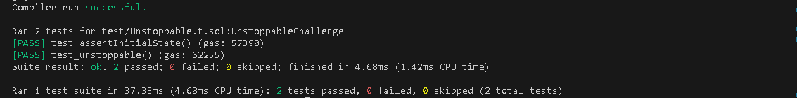

# Unstoppable

## Challenge

There's a tokenized vault with a million DVT tokens deposited. It’s offering flash loans for free, until the grace period ends.

To catch any bugs before going 100% permissionless, the developers decided to run a live beta in testnet. There's a monitoring contract to check liveness of the flashloan feature.

Starting with 10 DVT tokens in balance, show that it's possible to halt the vault. It must stop offering flash loans.

## Solution

I sent some tokens to the vault using transfer which will make it fail when it gets here:

```
if (convertToShares(totalSupply) != balanceBefore) revert InvalidBalance();
```

Because the internal account(shares) and external balance(assets) are not equal.

Then the monitor contract calls checkFlashLoan which basically tries to take a flash loan 

```
try vault.flashLoan(this, asset, amount, bytes("")) {
    emit FlashLoanStatus(true);
    } catch {
        // Something bad happened
        emit FlashLoanStatus(false);

        // Pause the vault
        vault.setPause(true);

        // Transfer ownership to allow review & fixes
        vault.transferOwnership(owner);
    }
```

And when it fails, pauses the vault contract and sets a new owner.



